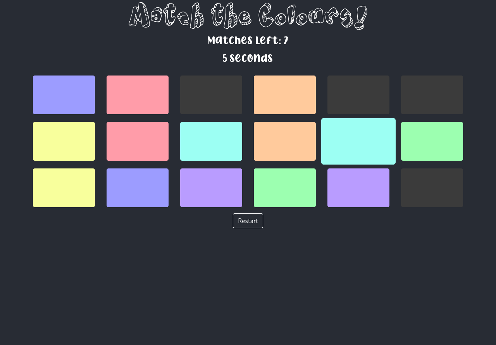
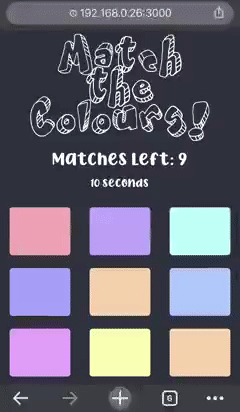

# Colour Matching Game

## Table of contents
* [Overview](#overview)
* [Examples](#examples)
* [Technologies](#technologies)
* [Setup](#setup)
* [Limitations](#limitations)

## Overview
This game spawns in nine different colours onto a grid of eighteen. This means that every colour has one matching tile. The goal of the game is to match all the colours with their shared colour tile before the timer runs out. If you match all the coloured tiles before the timer runs out, you win! Otherwise, you always have the opportunity to restart!

## Examples
### Screenshots of Browser

> Screenshot on Desktop Browser

> Screen Recording on Mobile

## Technologies
- **React 16.13**
- **Bootstrap 4.5**
- **node 14.3**
- **npm 6.14**

## Setup

### requirements
- Recent version of Node.js
  - Node >= 8.10
- Recent version of npm
  - npm >= 5.6

To run the project, make sure you have the requirements, clone the repository, and then start the website:

    git clone https://github.com/Alex0Blackwell/colour-match.git
    npm start

## Limitations
- [ ] No account system
  - scores are not saved

## License
Licensed under the [GNU General Public License v3.0](LICENSE)
